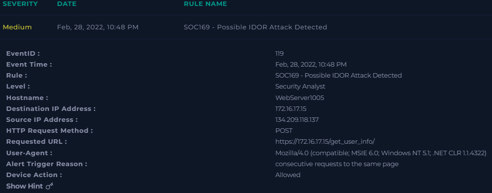
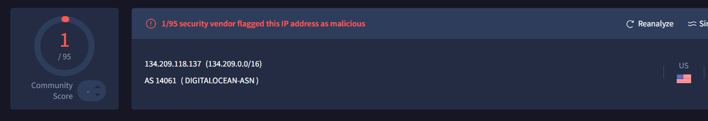

SOC169 - Possible IDOR Attack Detected
  

## Incident ID: SOC169-20220228 🔴 High

---

### 1. Summary
An external IP (**134.209.118.137, DigitalOcean**) made **consecutive POST requests** to `/get_user_info/` on internal web server **WebServer1005** (172.16.17.15).  
The requests incremented the `user_id` parameter, indicating a **possible IDOR attack**.  
All requests returned **HTTP 200**, meaning the attacker successfully accessed multiple user records. ✅

---

### 2. Alert Details

  

| Field | Value |
|-------|-------|
| EventID | 119 |
| Event Time | Feb 28, 2022, 10:48 PM |
| Rule | SOC169 - Possible IDOR Attack Detected |
| Level | Security Analyst |
| Hostname | WebServer1005 |
| Destination IP | 172.16.17.15 |
| Source IP | 134.209.118.137 |
| HTTP Method | POST |
| Requested URL | `https://172.16.17.15/get_user_info/` |
| User-Agent | Mozilla/4.0 (compatible; MSIE 6.0; Windows NT 5.1; .NET CLR 1.1.4322) |
| Alert Trigger Reason | Consecutive requests to same page |
| Device Action | Allowed |
| HTTP Response Status | 200 OK |
| HTTP Response Size | Varies (188–351 bytes) |

---

### 3. Source IP Analysis

  

| Field | Value |
|-------|-------|
| IP Address | 134.209.118.137 |
| Network | DigitalOcean (US) 🇺🇸 |
| ASN / Range | AS14061, 134.209.0.0/16 |
| Admin Contact | NOC – noc@digitalocean.com |
| Abuse Contact | DigitalOcean Abuse – abuse@digitalocean.com |
| Reputation | ⚠️ Possibly Malicious – Unauthorized data access |
| IP Type | Public Cloud / VPS |

---

### 4. Destination Device (Internal)

| Field | Value |
|-------|-------|
| IP Address | 172.16.17.15 |
| Hostname | WebServer1005 |
| Device Owner | webadmin35 |
| Last Logon | Feb 15, 2022, 01:43 PM |
| Device Role | Web server |
| Security Status | Compromised – IDOR attack succeeded |
| Firewall Action | Allowed |

---

### 5. Event Timeline

| Time | Source | Destination | Event / Action | Status |
|------|--------|-------------|----------------|--------|
| 10:45 PM | 134.209.118.137 | 172.16.17.15 | POST `/get_user_info/?user_id=2` | 🔴 Data Accessed |
| 10:45 PM | 134.209.118.137 | 172.16.17.15 | POST `/get_user_info/?user_id=1` | 🔴 Data Accessed |
| 10:46 PM | 134.209.118.137 | 172.16.17.15 | POST `/get_user_info/?user_id=3` | 🔴 Data Accessed |
| 10:47 PM | 134.209.118.137 | 172.16.17.15 | POST `/get_user_info/?user_id=4` | 🔴 Data Accessed |
| 10:48 PM | 134.209.118.137 | 172.16.17.15 | POST `/get_user_info/?user_id=5` | 🔴 Data Accessed |

---

### 6. SOC Analysis

- ✅ **True Positive Alert:** SOC169 correctly detected sequential POST requests indicating IDOR.  
- ⚠️ **Attack Outcome:** Attack **succeeded**; multiple user records were accessed.  
- 🛡 **Containment:** WebServer1005 isolated via Endpoint Security. External IP blocked.  
- 📈 **Escalation:** Tier 2 escalation performed due to successful data access.  
- 🌐 **Attack Source:** External Internet IP from DigitalOcean (US).  

---

### 7. SOC Recommendations

- Implement **authorization checks** for `user_id` in `/get_user_info/`.  
- Apply **rate limiting** to prevent sequential enumeration.  
- Deploy **WAF rules** to detect and block similar IDOR attempts.  
- Review **application and system logs** for other unauthorized access.  
- Report the malicious IP to **DigitalOcean Abuse team**.  

---

### 8. Reporting & Escalation Contacts

| Role | Contact |
|------|---------|
| Admin Contact | NOC – noc@digitalocean.com |
| Abuse Contact | DigitalOcean Abuse – abuse@digitalocean.com |

---

### 9. Color Legend

- 🔴 High Risk – Sensitive data accessed  
- 🟡 Warning – Attempt detected but no data accessed  
- 🟢 Normal – No malicious activity  

---

### 10. Conclusion
This incident represents a **successful IDOR attack** from an external DigitalOcean IP.  
Containment and Tier 2 escalation were initiated to prevent further exploitation.  
➡️ **Mitigation, monitoring, and application hardening are strongly recommended.**
